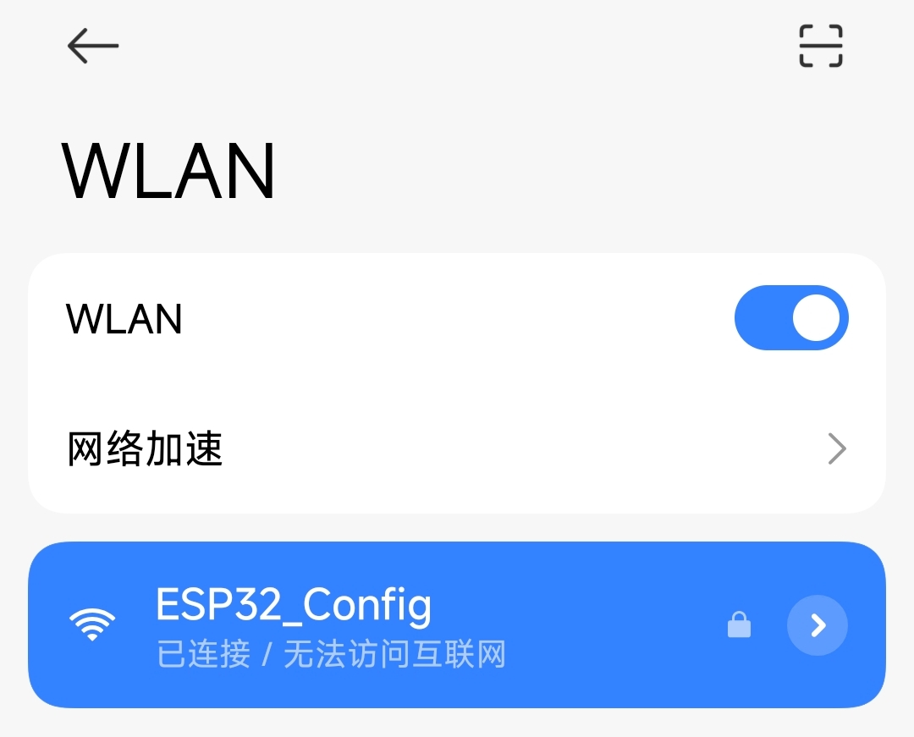
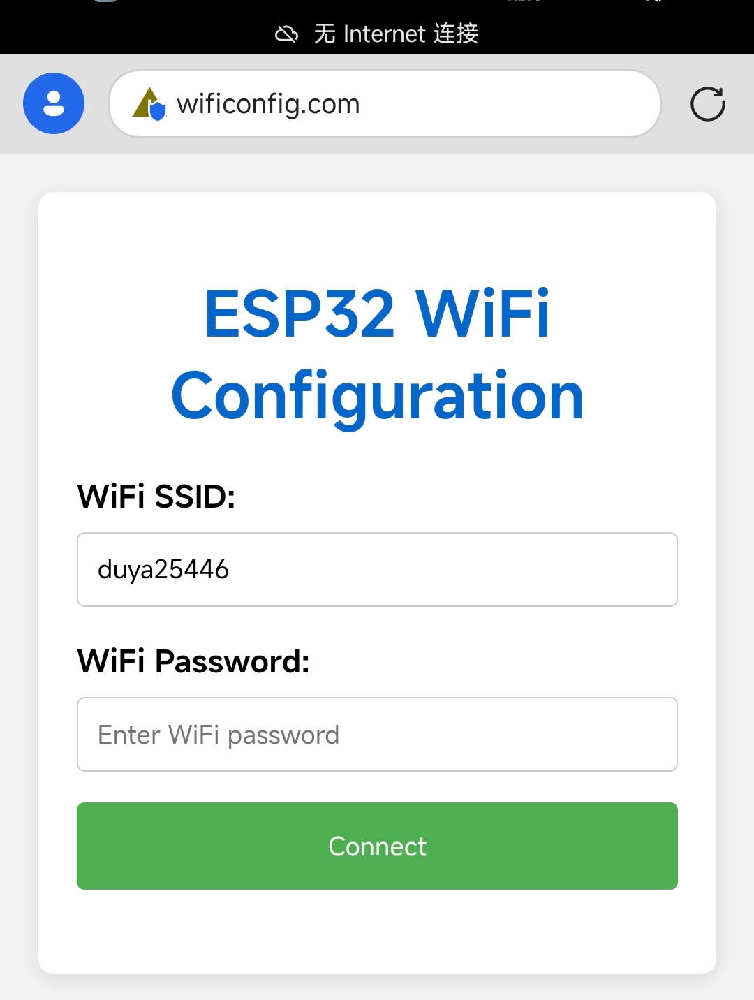
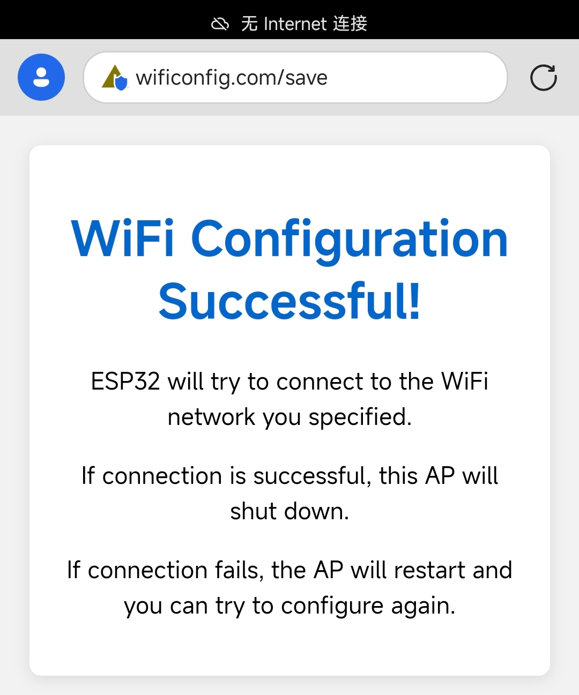

# ESP32 WiFiConfigManager 库

## 简介

ESP32 WiFiConfigManager 是一个便捷的Arduino ESP32 WiFi配置库，它能够帮助您的ESP32项目更容易地进行WiFi连接管理。通过该库，您可以：

- 创建一个配置门户（AP模式），允许用户通过手机或电脑轻松配置WiFi连接
- 自动保存用户配置的WiFi凭据到EEPROM
- 在设备重启后自动连接到保存的WiFi网络
- 通过友好的域名访问配置页面，无需记忆IP地址
- 自定义连接成功和AP模式激活的回调函数
- 简化ESP32项目中的WiFi管理逻辑

## 特性

- 🚀 简单易用的API设计
- 🔄 自动模式切换（STA/AP）
- 💾 配置持久化存储
- 📱 响应式Web配置界面
- 🔌 自定义DNS服务，可使用域名访问
- ⚙️ 可定制的超时和回调机制
- 🔒 支持AP模式密码保护

__注意，这个库引用了很多乐鑫的官方库，导致占用空间很多，单独编译该库的占用如下__


FOR ESP32 4MB:
>Sketch uses 946732 bytes (72%) of program storage space. Maximum is 1310720 bytes.
>Global variables use 45780 bytes (13%) of dynamic memory, leaving 281900 bytes for local variables. Maximum is 327680 bytes.

FOR ESP32S3 8MB:
>Sketch uses 911140 bytes (27%) of program storage space. Maximum is 3342336 bytes.
>Global variables use 44764 bytes (13%) of dynamic memory, leaving 282916 bytes for local variables. Maximum is 327680 bytes.

FOR ESP32C3 4MB:
>Sketch uses 973764 bytes (74%) of program storage space. Maximum is 1310720 bytes.
>Global variables use 35900 bytes (10%) of dynamic memory, leaving 291780 bytes for local variables. Maximum is 327680 bytes.
## 安装

很遗憾我不会上传到arduino lib也不会打包成zip,这就是一个.cpp和.h类，可以直接拉到你的项目文件夹内，arduino会自动引用同文件夹下的所有源文件，你可以直接在项目中 `#include <WiFiConfigManager.h>` 来使用这个类库。

## 基本使用

以下是一个简单的示例，演示如何在您的项目中使用WiFiConfigManager:

```cpp
#include <Arduino.h>
#include <WiFiConfigManager.h>

// 创建WiFiConfigManager实例
// 参数: AP名称, AP密码, AP域名
WiFiConfigManager wifiManager("ESP32_Config", "12345678", "wificonfig.com");

// 连接成功回调函数
void onWiFiConnected() {
  Serial.println("WiFi已连接！");
  // 在这里添加WiFi连接成功后需要执行的代码
}

// AP模式激活回调函数
void onAPModeActivated() {
  Serial.println("已进入配置模式");
  Serial.println("请连接到ESP32_Config热点，密码为12345678");
  Serial.println("然后打开浏览器访问 http://wificonfig.com 进行配置");
  // 可以在这里添加指示灯代码，表明设备处于配置模式
}

void setup() {
  Serial.begin(115200);
  Serial.println("启动中...");
  
  // 设置回调函数
  wifiManager.setConnectedCallback(onWiFiConnected);
  wifiManager.setAPModeCallback(onAPModeActivated);
  
  // 设置连接尝试超时时间（秒）
  wifiManager.setConnectionTimeout(15);
  
  // 初始化WiFiConfigManager
  wifiManager.begin();
}

void loop() {
  // 必须定期调用loop函数以处理HTTP请求和WiFi连接
  wifiManager.loop();
  
  // 检查WiFi连接状态并执行相应操作
  if (wifiManager.isConnected()) {
    // WiFi已连接，执行需要网络连接的操作
    // 例如：发送传感器数据到服务器等
  } else {
    // WiFi未连接，执行不需要网络连接的操作
    // 例如：本地数据采集、显示等
  }
}
```
到手机或电脑连接WiFi：



到浏览器输入配置的域名，默认配置为"wificonfig.com":



使用输入SSID和PASSWORD，点击连接，不出意外就会收到连接成功的页面：



如果连接WiFi成功，这个SSID和PASSWORD就会被记录到ESP32的Flash模拟的EEPROM中，下次启动时会直接尝试连接，如果连接失败会重新启动配置AP，如此就完成了一次WiFi的配置。

## 详细API文档

### 构造函数

```cpp
WiFiConfigManager(const char* apSSID = "ESP32_Config", 
                 const char* apPassword = "12345678",
                 const char* apDomain = "wificonfig.com",
                 int eepromSize = 128);
```

- `apSSID`: AP模式的WiFi名称
- `apPassword`: AP模式的WiFi密码
- `apDomain`: AP模式下的域名，用于访问配置页面
- `eepromSize`: EEPROM分配的大小（以字节为单位）

### 主要方法

#### `void begin()`
初始化WiFiConfigManager。如果有已保存的WiFi配置，会尝试连接；如果连接失败或没有保存的配置，会进入AP模式。

#### `void loop()`
必须在主loop中定期调用，用于处理HTTP请求和WiFi状态管理。

#### `bool isConnected()`
返回WiFi是否连接成功。

#### `IPAddress getIP()`
返回当前IP地址（AP模式时返回AP的IP，STA模式时返回分配的IP）。

#### `bool setWiFiCredentials(const String& ssid, const String& password)`
手动设置WiFi凭据并保存到EEPROM。

#### `void clearWiFiCredentials()`
清除存储的WiFi凭据。

#### `void setConnectionTimeout(int seconds)`
设置连接尝试的超时时间（默认20秒）。

#### `void setConnectedCallback(void (*callback)())`
设置WiFi连接成功的回调函数。

#### `void setAPModeCallback(void (*callback)())`
设置进入AP模式的回调函数。

## 配置页面使用指南

1. 当ESP32进入配置模式时，它会创建一个名为`apSSID`的WiFi热点
2. 使用您的手机或电脑连接到此热点（密码为`apPassword`）
3. 打开浏览器并访问`http://wificonfig.com`或`http://192.168.4.1`
4. 在配置页面中输入您要连接的WiFi网络的SSID和密码
5. 点击"连接"按钮
6. 若连接成功，ESP32将保存这些设置并重启为正常模式
7. 若连接失败，它将重新进入配置模式，您可以再次尝试

## 注意事项

- AP模式的DNS功能仅在设备连接到ESP32热点时有效
- 确保选择唯一的AP名称，避免与现有网络冲突
- 建议设置AP密码以增强安全性
- 配置页面使用的是纯HTML/CSS，无需外部资源，适合离线环境

## 高级使用

### 自定义配置页面

您可以通过修改库中的HTML模板来自定义配置页面的外观。在创建WiFiConfigManager实例后，可以使用setCustomHtml方法：

```cpp
const char* customHtml = R"rawliteral(
<!DOCTYPE html>
<html>
<head>
    <title>我的自定义WiFi配置</title>
    <meta name="viewport" content="width=device-width, initial-scale=1">
    <style>
        /* 您的自定义CSS */
    </style>
</head>
<body>
    <!-- 您的自定义HTML -->
    <form action="/save" method="post">
        <!-- 表单元素必须保留name属性 -->
        <input type="text" name="ssid">
        <input type="password" name="password">
        <input type="submit" value="保存配置">
    </form>
</body>
</html>
)rawliteral";

wifiManager.setCustomHtml(customHtml);
```

### 在特定条件下强制进入配置模式

```cpp
// 例如：使用一个按钮触发配置模式
const int configPin = 0; // GPIO0通常连接到ESP32开发板上的BOOT按钮

void setup() {
  // ...
  pinMode(configPin, INPUT_PULLUP);
  
  // 如果按钮被按下，清除存储的配置并进入AP模式
  if (digitalRead(configPin) == LOW) {
    Serial.println("按钮按下，进入配置模式");
    wifiManager.clearWiFiCredentials();
  }
  
  wifiManager.begin();
}
```

## 故障排除

如果您在使用过程中遇到问题，请尝试以下步骤：

1. **无法连接到AP热点**
   - 确保ESP32有足够的电源
   - 尝试重启设备
   - 检查AP密码是否正确

2. **配置页面不显示**
   - 尝试使用IP地址 `192.168.4.1` 代替域名
   - 确认您的设备已连接到ESP32的AP热点
   - 检查浏览器是否能正常加载其他网页

3. **WiFi凭据已保存但无法连接**
   - 确认输入的SSID和密码正确
   - 检查目标WiFi网络信号强度
   - 目标WiFi是否是隐藏网络或需要Web认证

4. **提交表单后页面出现错误**
   - 检查ESP32的串口输出查看详细错误信息
   - 可能是连接尝试过程中断开了AP连接，尝试增加超时时间

## 项目贡献

欢迎为这个项目做出贡献！您可以通过以下方式参与：

- 报告bug和提交功能需求
- 提交pull request改进代码或文档
- 分享您使用此库的项目案例

## 许可证

该项目采用MIT许可证

## 声明

本项目的注释和描述文档大部分使用AI生成，也有部分自己撰写。
希望这个库能简化您的ESP32项目WiFi配置过程！如有任何问题或建议，欢迎在GitHub仓库中提出issue。